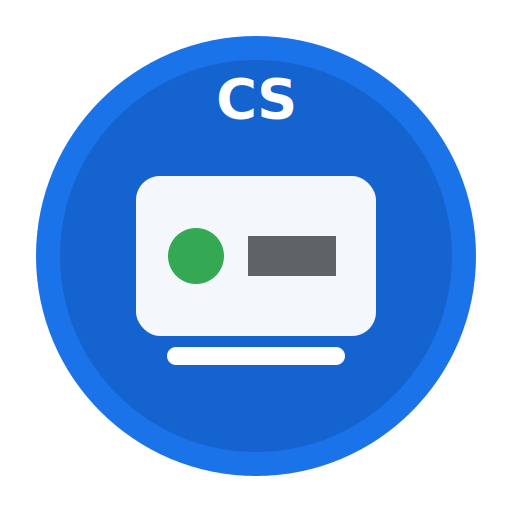

<p align="center">
  
</p>

<h1 align="center">Meet Překladač</h1>

<p align="center">
  Chrome rozšíření pro <strong>živý překlad Google Meet</strong> do češtiny.<br>
  Titulky z Meetu nebo Web Speech API → překlad přes Chrome nebo OpenRouter AI.
</p>

<p align="center">
  
  
  
  
</p>

---

## Tech stack

| Vrstva | Technologie |
|--------|-------------|
| **Platforma** | Chrome Extension Manifest V3 |
| **UI ve schůzce** | Vanilla JS + CSS (content script overlay) |
| **Nastavení** | HTML popup + `chrome.storage.sync` |
| **STT (řeč → text)** | Web Speech API (prohlížeč, zdarma) |
| **Titulky protistrany** | Scraping live captions z Google Meet DOM |
| **Překlad (rychlý)** | Chrome Built-in Translator API (on-device) |
| **Překlad (AI)** | [OpenRouter](https://openrouter.ai/) Chat Completions + SSE streaming |
| **Modely** | Free varianty (`:free`) — Llama, Gemma, Nemotron, GPT-OSS, Qwen… |
| **Background** | Service Worker (`fetch`, cache, stream port) |

---

## Požadavky

- **Google Chrome** (nebo Chromium) — doporučeno nejnovější verze
- Účet na **[OpenRouter](https://openrouter.ai/)** a **API klíč**  
  → [openrouter.ai/keys](https://openrouter.ai/keys)  
  *(Pro engine „Chrome on-device“ stačí prohlížeč; OpenRouter klíč je potřeba pro AI překlad a jako fallback v režimu Auto.)*
- Google Meet schůzka v prohlížeči na [meet.google.com](https://meet.google.com)

---

## Instalace (pro klienta / vývojáře)

Rozšíření zatím **není v Chrome Web Store** — instalace probíhá jako **rozbalené rozšíření**.

### 1. Stáhnout projekt

```bash
git clone https://github.com/daker52/meet-translator.git
cd meet-translator
```

Nebo stáhněte **ZIP** z GitHubu a rozbalte složku.

### 2. Načíst do Chrome

1. Otevřete `chrome://extensions/`
2. Zapněte **Režim pro vývojáře** (vpravo nahoře)
3. Klikněte **Načíst rozbalené**
4. Vyberte složku `meet-translator` (musí obsahovat `manifest.json`)
5. Připněte rozšíření ikonou 🧩 v liště prohlížeče

### 3. Nastavení OpenRouter API klíče

1. Klikněte na ikonu rozšíření **Meet Překladač**
2. Vložte **OpenRouter API klíč** (`sk-or-v1-…`)
3. Volitelně upravte:
   - **Engine:** `Auto` (doporučeno) / `Chrome on-device` / `OpenRouter AI`
   - **Model:** `Llama 3.2 3B` (nejrychlejší realtime)
   - **Jazyk zdroje / cíle:** např. EN → CS
4. Klikněte **Uložit nastavení**

> **Bezpečnost:** API klíč se ukládá pouze lokálně v prohlížeči. Nesdílejte ho a necommitujte do gitu.

---

## Jak spustit ve schůzce

1. Otevřete [Google Meet](https://meet.google.com) a připojte se ke schůzce
2. Zapněte **titulky v Meetu** — klávesa **`C`**
3. Klikněte na modré tlačítko **`CS`** (vpravo dole na obrazovce)
4. Zvolte režim **Meet titulky** (pro protistranu mluvící anglicky)
5. Překlad se zobrazí:
   - **dole na obrazovce** (live titulky)
   - **v panelu vpravo nahoře** (detail + historie)

### Režimy

| Režim | Kdy použít |
|-------|------------|
| **Meet titulky** | Protistrana mluví cizím jazykem — nejdřív zapněte titulky v Meetu (`C`) |
| **Web Speech** | Váš mikrofon / okolní řeč (povolte mikrofon) |

### Doporučené nastavení pro realtime

| Nastavení | Hodnota |
|-----------|---------|
| Engine | **Auto** nebo **Chrome on-device** |
| Model (OpenRouter) | **Llama 3.2 3B** nebo **LFM 2.5 1.2B** |
| Režim ve schůzce | **Meet titulky** |

Velké modely (70B+, 550B) mají lepší kvalitu, ale **příliš pomalé** pro živý překlad.

---

## OpenRouter — free modely

V rozšíření lze přepínat mezi free modely (kategorie v dropdownu):

- **Nejrychlejší:** Llama 3.2 3B, LFM 2.5 1.2B  
- **Vyvážené:** Gemma 4, GPT-OSS 20B, Nemotron Nano  
- **Nejlepší kvalita:** Qwen3 80B, Llama 3.3 70B, GPT-OSS 120B, Nemotron Ultra  
- **Auto:** `openrouter/free` — OpenRouter vybere dostupný free model  

Seznam modelů: [`lib/models.js`](lib/models.js)

---

## Struktura projektu

```
meet-translator/
├── manifest.json              # Chrome MV3 manifest
├── assets/
│   ├── icon.svg               # Logo (průhledné pozadí)
│   └── icon.png               # PNG varianta
├── background/
│   └── service-worker.js      # OpenRouter API, cache, streaming
├── content/
│   ├── content.js             # UI, titulky, Web Speech, překlad
│   └── content.css
├── lib/
│   └── models.js              # Seznam free modelů
└── popup/
    ├── popup.html             # Nastavení rozšíření
    ├── popup.js
    └── popup.css
```

---

## Omezení

- Web Speech API **nezachytí přímo audio protistrany** z Meetu → použijte režim **Meet titulky**
- Free modely OpenRouter mají **rate limity** (429) — zkuste jiný model nebo engine Chrome
- Google Meet občas mění DOM titulků — může vyžadovat aktualizaci selektorů
- Developer mode instalace není vhodná pro masové nasazení — pro produkci zvažte Chrome Web Store

---

## Aktualizace rozšíření

Po stažení nové verze z gitu:

```bash
git pull
```

V Chrome: `chrome://extensions/` → u **Meet Překladač** klikněte **Obnovit** (↻), pak obnovte záložku Meet (F5).

---

## Licence

MIT — volné použití a úpravy.

---

<p align="center">
  <sub>Vytvořeno pro překlad Google Meet schůzek do češtiny · OpenRouter free tier</sub>
</p>
